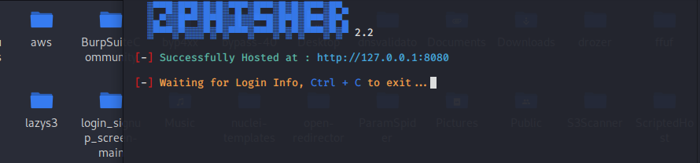

# The art of Phishing


https://github.com/Thabisocn/Phishing/assets/55186310/d46c913d-54ce-4428-9c47-646d236f6bbe


<h1 align="center">
 Phishing
  <br>
</h1>


<h4 align="center">Phishing is the process where by a victim/target are contacted either by email, telephone or text message by an attacker posing as a legitimate organization in order to lure individuals into providing sensitive data such as personally identifiable information, banking and credit card details, and passwords.   </h4>


<p align="center">
 <a href="#Types of Phishing emails">Types of phishing attacks</a> •
  <a href="#Phishing in action">Phishing in action</a> •
  <a href="#How to spot Phishing emails">How to spot Phishing emails</a> •
  <a href="#Preventing Phishing attacks">Preventing Phishing attacks</a> •
  <a href="#Recovery????????????????????????????????????????????">Recovery after being Phished</a> •
  <a href="#How to report phishing">How to report phishing</a>
</p>


# Types of Phishing emails

Phishing scams can come in a variety of types. Some phishing emails will ask you to click on a link to prevent your bank account or credit card from getting closed. When you click on the link, you’ll be taken to a website that asks for your personal financial information ,that could open the door to identity theft.Some other types of phishing attacks ask that you click on a link to verify that a credit card or bank account is yours.That link will take you to a fraudulent website that will ask you to provide sensitve information that will be captured by attackers.

My point is

 There are many types of phishing attacks. You need to be on the lookout for all of them but for this report we will only  be focusing on the 5 common types of Phishing.

 - Email Phishing
Attackers create emails that impersonate legitimate companies and attempt to steal your information

 - Spear Phishing
Its similiar to email phishing but the messages are more personalized.For example it may look like it comes from your Higher Up

 - Clone Phishing
Scammers replicate an email you have received, but now they include a dangerous attachment.


 - Whaling
Attackers target high ranking executives to gain access to their Sensitive data.This data is then used to launch an attack that could end up as an identity theft.

 - Pop-Up Phishing
Weird Pop-ups trick users into installing malware..


# Phishing in action

- Our attacker first begins by determining who their targeted victims will be (whether an organization or an individual) and specifically creates a plan to collect data.
- Our attacker creates methods like fake emails or Fake web pages to send messages that lure data from their victims.
- The attacker then send messages that appear trustworthy to the victims and begin the attack.
- Once the attack has been deployed, phishers will monitor and collect the data that victims provide on the fake web pages.
- Finally, phishers use the collected data to make illegal purchases,commit fraudulent acts and identity theft .


# How to spot Phishing emails

* Too Good To Be True - Phishing emails may try to hook a victim with what appears to be cheap offers for things like smartphones or vacations. DONT FALL FOR IT !!!!!
* Hyperlinks- If you receive an email that needs you to click on an unknown hyperlink, hovering over the link may show you that the link is really taking you to a fake, misspelled domain phishing scam.
* Spelling and grammatical mistakes
* Urgent deadlines - Attackers want you to act quickly, without thinking. That’s why many attackers will send emails asking you to immediately click on a link or send account information to avoid having your bank account or credit card suspended. Urgent requests for action are often phishing scams.
* Senders you think you recognize - You might get a phishing email from a name you recognize.That email may have come from the compromised email account of someone you know.(ke kgona go tsaya nako yame heela ke cheka gore ditsala tsa gago ke bo mang just to get to you. )
* Unrealistic financial rewards
* Mismatched URLs/ Domain name


# Preventing Phishing attacks

These are the techniques including best practices and tools that are largely used to stop phishing attacks and mitigate the effects of ones that do manage to bypass existing prevention mechanisms. 

```bash
# Comprehensive user education
$ Provide users with adequate education around perils of phishing, how to spot suspect communications and what to do once an attack has been identified.

# Don't open e-mails from senders you are not familiar with.

# Don't ever click on a link inside of an e-mail unless you know exactly where it's going.

# Mouseover the link to see if it's a legitimate link.

# Never enter personal information in pop-ups
$ Using Iframe technology, popups can easily capture personal information and send to a different domain.

```


## Recovery????????????????????????????????????????????

What if you've fallen for an email/socialmedia scam? Perhaps you sent credentials to a scammer .What you can do as a user is to act quickly as possible,
 Here are some steps you can take if you’ve been responded to a phishing scam to help protect yourself against identity theft.

- Change your passwords
- Contact your credit card providers
- Check your credit reports
- Study your credit card statements: Be on the lookout for any unauthorized or suspicious charges.

## How to report phishing

 - If its a Bank card/credit card the best thing to do is call your Card Provider 


## Me lauching an attack Kele mo Mochudi

Below is a step by step guide on How an attacker could Launch a Phishing attack


 - 1 - We first start by selecting an attack vector for your victim


- 2 - For this example we are going to be using Facebook's Login Page to capture our victims credentials


- 3 - For demonstration purposes we are going to be Running our Facebook Login Page Locally. If you want to make your phishing website public go with Ngrok.(with Ngrok you have the option to edit your URL to make it convincing but its a premium feature)


- 4 - On your Browser since the phishing site is running locally open http://127.0.0.1:8080/login.html




- 5 -  We managed to open the Phising site now we wait for the victim.


- 6 -  Our tool automatically stores the victims Ip address as soon as he/she goes to the link


- 7 - We have succesfully Phished a victims credentials yay !!!! 


## You may also like...

- [TrickShot  IO](https://github.com/Thabisoc123/Trickshot) - Trickshot IO app


---

> [www.nextgen-io.com](https://www.nextgen-io.com) &nbsp;&middot;&nbsp;
> GitHub [@Thabisoc123](https://github.com/Thabisoc123) &nbsp;&middot;&nbsp;
> Twitter [@CNThabiso](https://twitter.com/CNThabiso)


